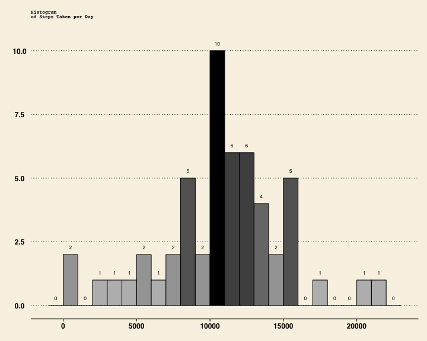
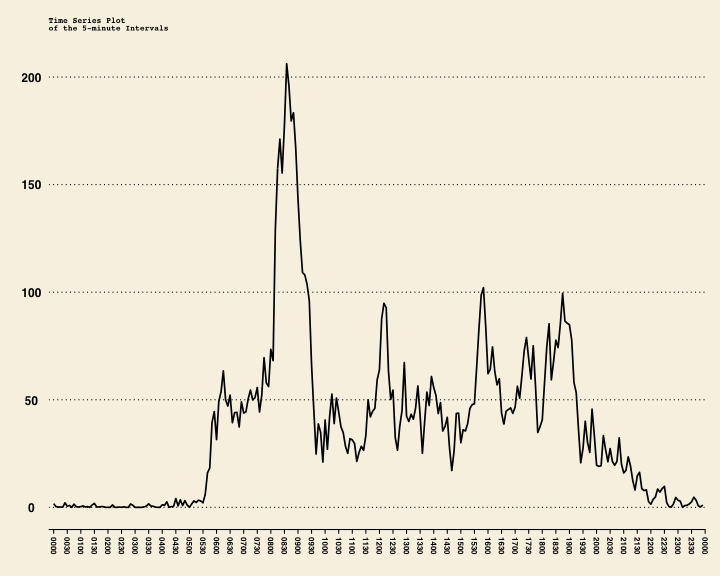
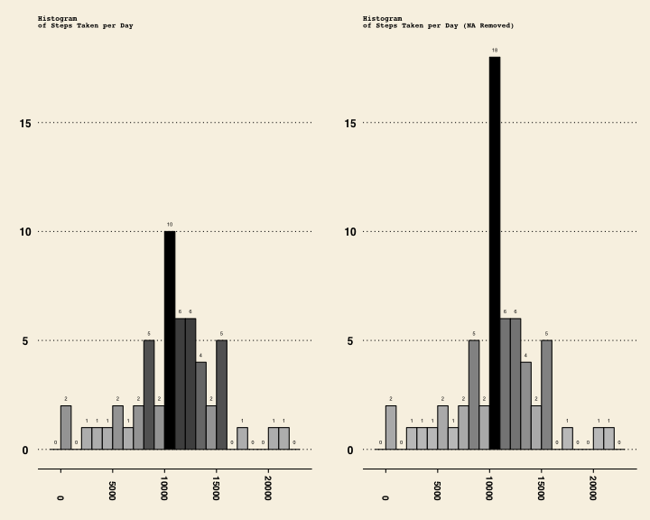

The purpose of this document is to develop and answer the Coursera Peer Assessment 1 for Coursera Reproducible Research.

### Step 1: Setup environment and load data set...

The first step is to load the required R packages, download and extract the target zip file into the data subdirectory, that we create if it does not exist. We then load the data into a data frame in preparation for manipulation. **Note:** This program assumes that all the data will be downloaded into the 'data' directory below the working directory.

#### Data

The data for this assignment is downloaded from the course [web site][1]:

- **Dataset**: [Activity monitoring data [52K]][2]

The variables included in this dataset are:

- **steps**: Number of steps taking in a 5-minute interval (missing values are coded as NA)
- **date**: The date on which the measurement was taken in YYYY-MM-DD format
- **interval**: Identifier for the 5-minute interval in which measurement was taken

The dataset is stored in a comma-separated-value (CSV) file and there are a total of 17,568 observations in this dataset.

[1]: https://class.coursera.org/repdata-012 "Reproducible Research"
[2]: https://d396qusza40orc.cloudfront.net/repdata%2Fdata%2Factivity.zip "Activity monitoring data"


```r
setwd("~/dev/cousera/courses/05_ReproducibleResearch/01_course_work/assessment1")

requiredPackages <- c("lubridate", # Used to for time formatting (well...) 
                      "ggplot2",   # Used to plot graphics 
                      "scales",    # Used to scales map data to aesthetics,  
                                   # and provide methods for automatically  
                                   # determining breaks and labels for axes 
                                   # and legends.
                      "gridExtra", # Used to map out plots in Grids
                      "ggthemes")  # Extra themes, scales and geoms for ggplot (Very cool!)

ipak <- function(pkg){
        new.pkg <- pkg[!(pkg %in% installed.packages()[, "Package"])]
        if (length(new.pkg))
                install.packages(new.pkg, dependencies = TRUE)
        sapply(pkg, require, character.only = TRUE)
}

ipak(requiredPackages)
```

```
## Loading required package: lubridate
## Loading required package: ggplot2
## Loading required package: scales
## Loading required package: gridExtra
## Loading required package: grid
## Loading required package: ggthemes
```

```
## lubridate   ggplot2    scales gridExtra  ggthemes 
##      TRUE      TRUE      TRUE      TRUE      TRUE
```

```r
dataDir         <- "./data"
fileUrl         <- "https://d396qusza40orc.cloudfront.net/repdata%2Fdata%2Factivity.zip"
fileName        <- "activity.csv"               # Extracted File Name
filePath        <- file.path(dataDir, fileName) # Filepath to extracted file

# If the data dir does not exist we create it, so it can be used to store the
# downloaded data

if (!file.exists(dataDir)) {
        dir.create(dataDir)
}

# Now we download the zip file... and extract it...

if (!file.exists(filePath)) {
        temp <- tempfile()
        download.file(fileUrl, temp, mode="wb", method = "curl")
        unzip(temp, exdir = dataDir)
        unlink(temp)
}

# Load the dataset in preperation for manipulation...

activityData <- read.csv(filePath, colClasses = c("numeric", "Date", "integer"))
str(activityData)
```

```
## 'data.frame':	17568 obs. of  3 variables:
##  $ steps   : num  NA NA NA NA NA NA NA NA NA NA ...
##  $ date    : Date, format: "2012-10-01" "2012-10-01" ...
##  $ interval: int  0 5 10 15 20 25 30 35 40 45 ...
```


## Step 2: Answers the questions posed...

### Question 1: What is the mean total number of steps taken per day?

** Note** For this part of the assignment, we are instructed we can ignore the missing values in the dataset.

1. Calculate the **total number of steps** taken **per day**

#### Answer:

The **mean** total of the number of steps taken per day is **10766.19**

See below for how this is calculated. 

We calculate the **total number of steps** taken **per day** by using the imported **activityData** and sum'ing the steps by day (date) to create the **stepsPerDay** dataframe that contains the number of steps by day...


```r
# Note: The default action of aggregate() is to ignore missing values in the 
# given variables. In essence, it automatically ignores missing values which is 
# what we want in this case...
# 
# If we did'nt ignore the NA values with would have a bar for values of NA/0...
# in the histogram...

stepsPerDay <- aggregate(steps ~ date, data = activityData, FUN = sum, na.action = na.omit)
stepsPerDay
```

```
##          date steps
## 1  2012-10-02   126
## 2  2012-10-03 11352
## 3  2012-10-04 12116
## 4  2012-10-05 13294
## 5  2012-10-06 15420
## 6  2012-10-07 11015
## 7  2012-10-09 12811
## 8  2012-10-10  9900
## 9  2012-10-11 10304
## 10 2012-10-12 17382
## 11 2012-10-13 12426
## 12 2012-10-14 15098
## 13 2012-10-15 10139
## 14 2012-10-16 15084
## 15 2012-10-17 13452
## 16 2012-10-18 10056
## 17 2012-10-19 11829
## 18 2012-10-20 10395
## 19 2012-10-21  8821
## 20 2012-10-22 13460
## 21 2012-10-23  8918
## 22 2012-10-24  8355
## 23 2012-10-25  2492
## 24 2012-10-26  6778
## 25 2012-10-27 10119
## 26 2012-10-28 11458
## 27 2012-10-29  5018
## 28 2012-10-30  9819
## 29 2012-10-31 15414
## 30 2012-11-02 10600
## 31 2012-11-03 10571
## 32 2012-11-05 10439
## 33 2012-11-06  8334
## 34 2012-11-07 12883
## 35 2012-11-08  3219
## 36 2012-11-11 12608
## 37 2012-11-12 10765
## 38 2012-11-13  7336
## 39 2012-11-15    41
## 40 2012-11-16  5441
## 41 2012-11-17 14339
## 42 2012-11-18 15110
## 43 2012-11-19  8841
## 44 2012-11-20  4472
## 45 2012-11-21 12787
## 46 2012-11-22 20427
## 47 2012-11-23 21194
## 48 2012-11-24 14478
## 49 2012-11-25 11834
## 50 2012-11-26 11162
## 51 2012-11-27 13646
## 52 2012-11-28 10183
## 53 2012-11-29  7047
```


#### Question 1.2. **Make a histogram of the total number of steps taken each day.** 

If you do not understand the difference between a histogram and a barplot, research the difference between them. 

#### Answer:

A histogram is "a representation of a frequency distribution by means of rectangles whose widths represent class intervals and whose areas are proportional to the corresponding frequencies. Essentially, we graph groups of numbers according to how often they appear. Thus if we have the set {1,2,2,3,3,3,3,4,4,5,6}, we would show a bar for two 2's, four 3's etc. The shape of the graph gives us an idea of how the numbers in the set are distributed about the mean; the distribution of this graph is wide compared to size of the peak, indicating that values in the set are only loosely bunched around the mean. With a *histogram*, we can **bin** the data into convenient ranges to categorize the data into ranges or buckets.

In this context, we want to create a histogram that shows **steps taken per day**, to do this we took the activity data (**activityData**) and aggregate the steps by day (**stepsperDay**) and plot this data using *ggplot2* **geom_historgram()** and divide the data into bin sizes of 1000 steps resulting in the histogram shown below.  


```r
gp <- ggplot(stepsPerDay, aes(x=steps)) 
gp <- gp + theme_wsj()
gp <- gp + geom_histogram(aes(fill = ..count..), binwidth=1000, color="black", width=.2)
gp <- gp + scale_fill_gradient("Steps", low = "lightgrey", high = "black")
# One thing we want to do is show the bin count above each bar of the histogram.
# We do this by using the stat_bin() function, where we set the label to the
# count of the bin as defiend by the binwidth...
gp <- gp + stat_bin(binwidth = 1000,
                    aes( y = (..count..),
                         label = (..count..), 
                         ymax = max(..count..) * 1.05 ), 
                    geom  = "text", 
                    size  = 3,
                    vjust = -1.5)
gp <- gp + xlab(paste0("\n","Step Count Bins (Bin=1000)"))
gp <- gp + ylab(paste0("Frequency","\n"))
# Here we create a plot title across two lines...
title <- paste("Histogram")
title2 <- paste("of Steps Taken per Day")
gp <- gp + ggtitle(paste0(title,"\n", title2, "\n"))
gp <- gp + theme(legend.position="none", plot.title = element_text(size=8, lineheight=.8, face="bold"))
# Now display the plot...
print(gp)
```

 

#### Question 1.3. Calculate and report the **mean** and **median** of the **total number of steps** taken **per day**

#### Answer:

To calculate the **mean** and **medium** we take the dataframe we created earlier and calculate the **mean** and **medium** across of the **steps** column in the **stepsPerDay** dataframe. We can now compare that with the **histogram** we created earlier. 

*Note that the histogram maps to the mean and medium results below; t is important to note that we omit NA values based on the use of aggregate() to create the stepsPerDay counts* **(Useful Self Check)**

#### Result: 

Mean =  **10766.19**
Medium = **10765**


```r
mean(stepsPerDay$steps)
```

```
## [1] 10766.19
```

```r
median(stepsPerDay$steps)
```

```
## [1] 10765
```

### Question 2: What is the average daily activity pattern?

#### 2.1. Make a time series plot (i.e. type = "l") of the 5-minute interval (x-axis) and the average number of steps taken, averaged across all days (y-axis)

#### Answer:

The interval maps to 0, 5, 10 ... 55, then jumps to 100, 105... 155; which essentially implies the data creates a sample every five minutes over an hour. Ok, so we need to show the average activity across the whole data set. We can do this by aggregating the step data by interval - we generate the mean of all step values of the same interval value) 

Note that we cast the Interval from a factor to a numeric...


```r
avgSteps <- aggregate(steps ~ interval, activityData, FUN = mean)
names(avgSteps)[1] <- "interval"
names(avgSteps)[2] <- "avgSteps"
```

Here is the problem... the resulting dataframe interval column needs to be converted to hour format...

i.e. HH:MM

this then can be used in the ggplot2 graph to correctly map the data across the day on the X axis as time value... 


```r
avgSteps$interval <- sprintf("%04d", avgSteps$interval)
avgSteps$interval <- as.POSIXct(avgSteps$interval, format = "%H%M")
```


```r
rm(gp)
gp <- ggplot(avgSteps, aes(x = interval, y = avgSteps))
gp <- gp + theme_wsj()
gp <- gp + geom_line(size = .8)
gp <- gp + theme(axis.text.x=element_text(angle=270,hjust=1,vjust=0.5, size=8, color="black"))
gp <- gp + scale_x_datetime(breaks = date_breaks("30 mins"),
                            labels = date_format("%H%M"),
                            limits = c(avgSteps$interval[12], avgSteps$interval[286-10]))
gp <- gp + xlab(paste0("\n","Sampled averages across 5-minute intervals over each day"))
gp <- gp + ylab(paste0("Average Number of Steps Taken","\n"))
# Here we create a plot title across two lines...
title <- paste("Time Series Plot ")
title2 <- paste("of the 5-minute Intervals")
gp <- gp + ggtitle(paste0(title,"\n", title2, "\n"))
gp <- gp + theme(plot.title = element_text(size=8, lineheight=.8, face="bold"))
# Now display the plot...
print(gp)
```

 

#### 2.1. Which 5-minute interval, on average across all the days in the dataset, contains the maximum number of steps?

#### Answer:

The 5 minute data interval at **8:35** in the morning contains the maximum number of steps on average across all the days tracked. 

To determine this, we calculate the max value in the avgSteps and use that as the index into avgSteps to return the correct time index. The index time matches to the time series diagram. (**Useful Self check**)


```r
avgSteps[which.max(avgSteps$avgSteps),]
```

```
##                interval avgSteps
## 104 2015-03-12 08:35:00 206.1698
```

### Question 3: Imputing missing values

Note that there are a number of days/intervals where there are missing values (coded as NA). The presence of missing days may introduce bias into some calculations or summaries of the data.

#### 3.1. Calculate and report the total number of missing values in the dataset (i.e. the total number of rows with NAs)

#### Answer:

The total number of NA values is **2304**, we caculate this by summing the number of values that are NA in the **activityData$steps** set. Here we use the complete.case() function to return a logical vector indicating which cases are complete, i.e., which have missing values. We negate the result to determine this.


```r
sum(!complete.cases(activityData))
```

```
## [1] 2304
```

#### 3.2. Devise a strategy for filling in all of the missing values in the dataset. The strategy does not need to be sophisticated. For example, you could use the mean/median for that day, or the mean for that 5-minute interval, etc.

#### Answer:

So if we visually peruse the **activityData** data set we can see that certain days clearly have no data... OK, so which days? The approach taken to determine this is to subset the data and create a new table of **activityNAData**. Our goal is to match on any row with incomplete data, extract it and put it into a new table **activityNAData**.

OK, so we have **Eight** days that have no data (NA)


```r
activityNAData <- subset(activityData, !complete.cases(activityData))
table(activityNAData$date)
```

```
## 
## 2012-10-01 2012-10-08 2012-11-01 2012-11-04 2012-11-09 2012-11-10 
##        288        288        288        288        288        288 
## 2012-11-14 2012-11-30 
##        288        288
```

#### 3.3. Create a new dataset that is equal to the original dataset but with the missing data filled in.

#### Answer:

Ok, so we need to fill in eight days of data - hmmm. 

We could make up the data, or use some varient of the data we have already... For example, the averaged data across the data set (**avgSteps**), the best option appears to me to take the average daily data and use it to fill in the missing data. 

The advantage of this approach is that if the person being monitored followed a routine of any kind, the averaged data should reflect that. For example - on average the person or persons in the data set appear to be most active at 8:35 in the morning...

So to do this we want to take each NA interval value in **activityData** and replace it with the equivalent average value. We do this with transform(), we check to see if a value is "*NA*", if it is we replace it with the equivalent interval average value.


```r
avgStepsList <- tapply(activityData$steps, activityData$interval, mean, na.rm=T)
activityDataNARemoved <- transform(activityData, steps=ifelse(is.na(steps), avgStepsList, steps))
```

#### 3.4. Make a histogram of the total number of steps taken each day and Calculate and report the mean and median total number of steps taken per day. 

#### Answer:

The histogram is displayed below:


```r
rm(gp)
gp <- ggplot(stepsPerDay, aes(x=steps))
gp <- gp + theme_wsj()
gp <- gp + geom_histogram(aes(fill = ..count..), binwidth=1000, color="black", width=.2)
gp <- gp + scale_fill_gradient("Steps", low = "lightgrey", high = "black")
gp <- gp + ylim(0,18)
# One thing we want to do is show the bin count above each bar of the histogram.
# We do this by using the stat_bin() function, where we set the label to the
# count of the bin as defiend by the binwidth...
gp <- gp + stat_bin(binwidth = 1000,
                    aes( y = (..count..),
                         label = (..count..), 
                         ymax = max(..count..) * 1.05 ), 
                    geom  = "text", 
                    size  = 2,
                    vjust = -1.5)
gp <- gp + xlab(paste0("\n","Step Count Bins (Bin=1000)"))
gp <- gp + ylab(paste0("Frequency","\n"))
gp <- gp + theme(axis.text.x=element_text(angle=270,
                                   hjust=1,
                                   vjust=0.5,
                                   size = 10)) 
# Here we create a plot title across two lines...
title <- paste("Histogram")
title2 <- paste("of Steps Taken per Day")
gp <- gp + ggtitle(paste0(title,"\n", title2, "\n"))
# Remove legend from first histogram... i.e. legend.position="none"
gp <- gp + theme(legend.position="none", plot.title = element_text(size=8, lineheight=.8, face="bold"))

stepsPerDayNARemoved <- aggregate(steps ~ date, data = activityDataNARemoved, FUN = sum)

gp1 <- ggplot(stepsPerDayNARemoved, aes(x=steps))
gp1 <- gp1 + theme_wsj()
gp1 <- gp1 + geom_histogram(aes(fill = ..count..), binwidth=1000, color="black", width=.2)
gp1 <- gp1 + scale_fill_gradient("Steps", low = "lightgrey", high = "black")
gp1 <- gp1 + ylim(0,18)
# One thing we want to do is show the bin count above each bar of the histogram.
# We do this by using the stat_bin() function, where we set the label to the
# count of the bin as defiend by the binwidth...
gp1 <- gp1 + stat_bin(binwidth = 1000,
                    aes( y = (..count..),
                         label = (..count..), 
                         ymax = max(..count..) * 1.05 ), 
                    geom  = "text", 
                    size  = 2,
                    vjust = -1.5)
gp1 <- gp1 + xlab(paste0("\n","Step Count Bins (Bin=1000)"))
gp1 <- gp1 + theme(axis.text.x=element_text(angle=270,
                                   hjust=1,
                                   vjust=0.5,
                                   size = 10)) 
# Here we create a plot title across two lines...
title <- paste("Histogram")
title2 <- paste("of Steps Taken per Day (NA Removed)")
gp1 <- gp1 + ggtitle(paste0(title,"\n", title2, "\n"))
gp1 <- gp1 + theme(legend.position="none", plot.title = element_text(size=8, lineheight=.8, face="bold"))
# Now display the plots in a grid using gridExtra fucntionality...
grid.arrange(gp, gp1, ncol = 2)
```

 

#### 3.5 Do these values differ from the estimates from the first part of the assignment? 

#### Answer

Yes, the values are changed from the first part of the assignment, though only slightly. 

The **mean** is unchanged, whilst the **median** is increased.

#### 3.6 What is the impact of imputing missing data on the estimates of the total daily number of steps?

#### Answer

The replacement of the NA values in the activity data set with the averaged data values has the impact of increasesing the peak from 10 to 18 observations. This arguably does not impact the overall data (at least in my opinion).

- Mean *before* populating the missing NA values is **10766.19**
- Median *before* populating the missing NA values is **10765**
- Mean *after* populating missing NA values is **10766.19**
- Median *after* populating the missing NA values is **10766.19**


```r
mean(stepsPerDay$steps)
```

```
## [1] 10766.19
```

```r
median(stepsPerDay$steps)
```

```
## [1] 10765
```


```r
mean(stepsPerDayNARemoved$steps)
```

```
## [1] 10766.19
```

```r
median(stepsPerDayNARemoved$steps)
```

```
## [1] 10766.19
```
### Question 4. Are there differences in activity patterns between weekdays and weekends?

For this part the weekdays() function may be of some help here. Use the dataset with the filled-in missing values for this part.

### Answer

If we review the plot below we can determine that the participant during the week get up early (5:30am) and is very active 8:30 and 9:30 (approximately) in contrast to the weekends where they are generally less active in the morning but appears generally more active across the broader 24 hour period.

#### 4.1 Create a new factor variable in the dataset with two levels – “weekday” and “weekend” indicating whether a given date is a weekday or weekend day.

#### Answer:


```r
impute          <- transform(activityData, steps=ifelse(is.na(steps), avgSteps$avgSteps, steps))
# Here we create the new factor varialble 'week' for use in creating the plot.
week            <- factor(weekdays(impute$date) %in% c("Saturday","Sunday"), 
                          labels=c("weekday","weekend"), ordered=FALSE)
impsteps        <- aggregate(impute$steps, by=list(interval=impute$interval, weekday=week), mean)
names(impsteps)[3] <- "avgSteps"
impsteps$interval <- sprintf("%04d", impsteps$interval)
impsteps$interval <- as.POSIXct(impsteps$interval, format = "%H%M")
impsteps
```

```
##                interval weekday     avgSteps
## 1   2015-03-12 00:00:00 weekday 2.251153e+00
## 2   2015-03-12 00:05:00 weekday 4.452830e-01
## 3   2015-03-12 00:10:00 weekday 1.731656e-01
## 4   2015-03-12 00:15:00 weekday 1.979036e-01
## 5   2015-03-12 00:20:00 weekday 9.895178e-02
## 6   2015-03-12 00:25:00 weekday 1.590356e+00
## 7   2015-03-12 00:30:00 weekday 6.926625e-01
## 8   2015-03-12 00:35:00 weekday 1.137945e+00
## 9   2015-03-12 00:40:00 weekday 0.000000e+00
## 10  2015-03-12 00:45:00 weekday 1.796226e+00
## 11  2015-03-12 00:50:00 weekday 3.958071e-01
## 12  2015-03-12 00:55:00 weekday 1.761006e-02
## 13  2015-03-12 01:00:00 weekday 4.205451e-01
## 14  2015-03-12 01:05:00 weekday 9.056604e-02
## 15  2015-03-12 01:10:00 weekday 1.979036e-01
## 16  2015-03-12 01:15:00 weekday 4.452830e-01
## 17  2015-03-12 01:20:00 weekday 0.000000e+00
## 18  2015-03-12 01:25:00 weekday 1.459539e+00
## 19  2015-03-12 01:30:00 weekday 2.221803e+00
## 20  2015-03-12 01:35:00 weekday 2.264151e-02
## 21  2015-03-12 01:40:00 weekday 2.226415e-01
## 22  2015-03-12 01:45:00 weekday 2.503145e-01
## 23  2015-03-12 01:50:00 weekday 3.463312e-01
## 24  2015-03-12 01:55:00 weekday 0.000000e+00
## 25  2015-03-12 02:00:00 weekday 0.000000e+00
## 26  2015-03-12 02:05:00 weekday 0.000000e+00
## 27  2015-03-12 02:10:00 weekday 1.395388e+00
## 28  2015-03-12 02:15:00 weekday 0.000000e+00
## 29  2015-03-12 02:20:00 weekday 0.000000e+00
## 30  2015-03-12 02:25:00 weekday 1.731656e-01
## 31  2015-03-12 02:30:00 weekday 0.000000e+00
## 32  2015-03-12 02:35:00 weekday 2.968553e-01
## 33  2015-03-12 02:40:00 weekday 0.000000e+00
## 34  2015-03-12 02:45:00 weekday 0.000000e+00
## 35  2015-03-12 02:50:00 weekday 2.028512e+00
## 36  2015-03-12 02:55:00 weekday 1.236897e+00
## 37  2015-03-12 03:00:00 weekday 0.000000e+00
## 38  2015-03-12 03:05:00 weekday 0.000000e+00
## 39  2015-03-12 03:10:00 weekday 0.000000e+00
## 40  2015-03-12 03:15:00 weekday 0.000000e+00
## 41  2015-03-12 03:20:00 weekday 2.767296e-02
## 42  2015-03-12 03:25:00 weekday 8.163522e-01
## 43  2015-03-12 03:30:00 weekday 1.238574e+00
## 44  2015-03-12 03:35:00 weekday 5.224319e-01
## 45  2015-03-12 03:40:00 weekday 4.209644e-01
## 46  2015-03-12 03:45:00 weekday 9.895178e-02
## 47  2015-03-12 03:50:00 weekday 0.000000e+00
## 48  2015-03-12 03:55:00 weekday 0.000000e+00
## 49  2015-03-12 04:00:00 weekday 2.696017e-01
## 50  2015-03-12 04:05:00 weekday 1.236897e+00
## 51  2015-03-12 04:10:00 weekday 2.231027e+00
## 52  2015-03-12 04:15:00 weekday 0.000000e+00
## 53  2015-03-12 04:20:00 weekday 4.452830e-01
## 54  2015-03-12 04:25:00 weekday 4.779874e-02
## 55  2015-03-12 04:30:00 weekday 3.370650e+00
## 56  2015-03-12 04:35:00 weekday 2.213836e-01
## 57  2015-03-12 04:40:00 weekday 3.776520e+00
## 58  2015-03-12 04:45:00 weekday 8.884696e-01
## 59  2015-03-12 04:50:00 weekday 2.348428e+00
## 60  2015-03-12 04:55:00 weekday 7.262055e-01
## 61  2015-03-12 05:00:00 weekday 0.000000e+00
## 62  2015-03-12 05:05:00 weekday 2.053249e+00
## 63  2015-03-12 05:10:00 weekday 3.933333e+00
## 64  2015-03-12 05:15:00 weekday 2.188260e+00
## 65  2015-03-12 05:20:00 weekday 4.220545e+00
## 66  2015-03-12 05:25:00 weekday 2.706080e+00
## 67  2015-03-12 05:30:00 weekday 2.745912e+00
## 68  2015-03-12 05:35:00 weekday 7.940881e+00
## 69  2015-03-12 05:40:00 weekday 2.040252e+01
## 70  2015-03-12 05:45:00 weekday 2.364528e+01
## 71  2015-03-12 05:50:00 weekday 5.034927e+01
## 72  2015-03-12 05:55:00 weekday 5.626541e+01
## 73  2015-03-12 06:00:00 weekday 4.128763e+01
## 74  2015-03-12 06:05:00 weekday 6.459078e+01
## 75  2015-03-12 06:10:00 weekday 7.008092e+01
## 76  2015-03-12 06:15:00 weekday 7.714927e+01
## 77  2015-03-12 06:20:00 weekday 6.392830e+01
## 78  2015-03-12 06:25:00 weekday 6.003229e+01
## 79  2015-03-12 06:30:00 weekday 6.644235e+01
## 80  2015-03-12 06:35:00 weekday 4.797862e+01
## 81  2015-03-12 06:40:00 weekday 5.566918e+01
## 82  2015-03-12 06:45:00 weekday 5.486709e+01
## 83  2015-03-12 06:50:00 weekday 4.704780e+01
## 84  2015-03-12 06:55:00 weekday 6.042725e+01
## 85  2015-03-12 07:00:00 weekday 5.059706e+01
## 86  2015-03-12 07:05:00 weekday 5.082809e+01
## 87  2015-03-12 07:10:00 weekday 6.202348e+01
## 88  2015-03-12 07:15:00 weekday 6.933459e+01
## 89  2015-03-12 07:20:00 weekday 6.310105e+01
## 90  2015-03-12 07:25:00 weekday 5.910860e+01
## 91  2015-03-12 07:30:00 weekday 6.622390e+01
## 92  2015-03-12 07:35:00 weekday 5.435388e+01
## 93  2015-03-12 07:40:00 weekday 6.272411e+01
## 94  2015-03-12 07:45:00 weekday 8.338407e+01
## 95  2015-03-12 07:50:00 weekday 6.773543e+01
## 96  2015-03-12 07:55:00 weekday 6.657568e+01
## 97  2015-03-12 08:00:00 weekday 8.271698e+01
## 98  2015-03-12 08:05:00 weekday 7.196101e+01
## 99  2015-03-12 08:10:00 weekday 1.440134e+02
## 100 2015-03-12 08:15:00 weekday 1.819816e+02
## 101 2015-03-12 08:20:00 weekday 2.005757e+02
## 102 2015-03-12 08:25:00 weekday 1.836084e+02
## 103 2015-03-12 08:30:00 weekday 1.988847e+02
## 104 2015-03-12 08:35:00 weekday 2.303782e+02
## 105 2015-03-12 08:40:00 weekday 2.189010e+02
## 106 2015-03-12 08:45:00 weekday 1.856532e+02
## 107 2015-03-12 08:50:00 weekday 1.912306e+02
## 108 2015-03-12 08:55:00 weekday 1.770914e+02
## 109 2015-03-12 09:00:00 weekday 1.676604e+02
## 110 2015-03-12 09:05:00 weekday 1.257828e+02
## 111 2015-03-12 09:10:00 weekday 9.394843e+01
## 112 2015-03-12 09:15:00 weekday 8.730398e+01
## 113 2015-03-12 09:20:00 weekday 1.035400e+02
## 114 2015-03-12 09:25:00 weekday 9.246164e+01
## 115 2015-03-12 09:30:00 weekday 5.851656e+01
## 116 2015-03-12 09:35:00 weekday 3.585241e+01
## 117 2015-03-12 09:40:00 weekday 2.746122e+01
## 118 2015-03-12 09:45:00 weekday 4.085618e+01
## 119 2015-03-12 09:50:00 weekday 3.913082e+01
## 120 2015-03-12 09:55:00 weekday 1.762977e+01
## 121 2015-03-12 10:00:00 weekday 3.787547e+01
## 122 2015-03-12 10:05:00 weekday 1.821971e+01
## 123 2015-03-12 10:10:00 weekday 3.907757e+01
## 124 2015-03-12 10:15:00 weekday 4.782138e+01
## 125 2015-03-12 10:20:00 weekday 3.034549e+01
## 126 2015-03-12 10:25:00 weekday 3.515010e+01
## 127 2015-03-12 10:30:00 weekday 3.312662e+01
## 128 2015-03-12 10:35:00 weekday 2.425535e+01
## 129 2015-03-12 10:40:00 weekday 2.351530e+01
## 130 2015-03-12 10:45:00 weekday 2.591195e+01
## 131 2015-03-12 10:50:00 weekday 2.203480e+01
## 132 2015-03-12 10:55:00 weekday 2.325912e+01
## 133 2015-03-12 11:00:00 weekday 2.169224e+01
## 134 2015-03-12 11:05:00 weekday 2.509057e+01
## 135 2015-03-12 11:10:00 weekday 1.168721e+01
## 136 2015-03-12 11:15:00 weekday 1.627296e+01
## 137 2015-03-12 11:20:00 weekday 2.418365e+01
## 138 2015-03-12 11:25:00 weekday 2.372956e+01
## 139 2015-03-12 11:30:00 weekday 3.276897e+01
## 140 2015-03-12 11:35:00 weekday 5.019748e+01
## 141 2015-03-12 11:40:00 weekday 4.456059e+01
## 142 2015-03-12 11:45:00 weekday 4.792495e+01
## 143 2015-03-12 11:50:00 weekday 5.011614e+01
## 144 2015-03-12 11:55:00 weekday 5.613627e+01
## 145 2015-03-12 12:00:00 weekday 5.571572e+01
## 146 2015-03-12 12:05:00 weekday 7.284864e+01
## 147 2015-03-12 12:10:00 weekday 8.364654e+01
## 148 2015-03-12 12:15:00 weekday 7.528092e+01
## 149 2015-03-12 12:20:00 weekday 4.871950e+01
## 150 2015-03-12 12:25:00 weekday 4.682264e+01
## 151 2015-03-12 12:30:00 weekday 6.257400e+01
## 152 2015-03-12 12:35:00 weekday 3.074423e+01
## 153 2015-03-12 12:40:00 weekday 2.198155e+01
## 154 2015-03-12 12:45:00 weekday 2.932034e+01
## 155 2015-03-12 12:50:00 weekday 3.278532e+01
## 156 2015-03-12 12:55:00 weekday 5.659329e+01
## 157 2015-03-12 13:00:00 weekday 2.460084e+01
## 158 2015-03-12 13:05:00 weekday 2.574046e+01
## 159 2015-03-12 13:10:00 weekday 2.456855e+01
## 160 2015-03-12 13:15:00 weekday 1.564193e+01
## 161 2015-03-12 13:20:00 weekday 3.563270e+01
## 162 2015-03-12 13:25:00 weekday 4.485786e+01
## 163 2015-03-12 13:30:00 weekday 3.176730e+01
## 164 2015-03-12 13:35:00 weekday 2.330650e+01
## 165 2015-03-12 13:40:00 weekday 2.523941e+01
## 166 2015-03-12 13:45:00 weekday 4.018407e+01
## 167 2015-03-12 13:50:00 weekday 2.557610e+01
## 168 2015-03-12 13:55:00 weekday 3.633040e+01
## 169 2015-03-12 14:00:00 weekday 4.692285e+01
## 170 2015-03-12 14:05:00 weekday 3.955052e+01
## 171 2015-03-12 14:10:00 weekday 3.212243e+01
## 172 2015-03-12 14:15:00 weekday 4.504864e+01
## 173 2015-03-12 14:20:00 weekday 2.748512e+01
## 174 2015-03-12 14:25:00 weekday 3.076184e+01
## 175 2015-03-12 14:30:00 weekday 3.149099e+01
## 176 2015-03-12 14:35:00 weekday 1.451237e+01
## 177 2015-03-12 14:40:00 weekday 1.154843e+01
## 178 2015-03-12 14:45:00 weekday 2.198784e+01
## 179 2015-03-12 14:50:00 weekday 4.186080e+01
## 180 2015-03-12 14:55:00 weekday 3.828092e+01
## 181 2015-03-12 15:00:00 weekday 3.086918e+01
## 182 2015-03-12 15:05:00 weekday 3.505451e+01
## 183 2015-03-12 15:10:00 weekday 2.995430e+01
## 184 2015-03-12 15:15:00 weekday 3.191321e+01
## 185 2015-03-12 15:20:00 weekday 3.986164e+01
## 186 2015-03-12 15:25:00 weekday 3.734507e+01
## 187 2015-03-12 15:30:00 weekday 4.212872e+01
## 188 2015-03-12 15:35:00 weekday 5.093166e+01
## 189 2015-03-12 15:40:00 weekday 9.056520e+01
## 190 2015-03-12 15:45:00 weekday 9.586583e+01
## 191 2015-03-12 15:50:00 weekday 9.394843e+01
## 192 2015-03-12 15:55:00 weekday 7.030608e+01
## 193 2015-03-12 16:00:00 weekday 4.688428e+01
## 194 2015-03-12 16:05:00 weekday 4.519539e+01
## 195 2015-03-12 16:10:00 weekday 5.660629e+01
## 196 2015-03-12 16:15:00 weekday 3.613375e+01
## 197 2015-03-12 16:20:00 weekday 2.680964e+01
## 198 2015-03-12 16:25:00 weekday 2.952537e+01
## 199 2015-03-12 16:30:00 weekday 2.251572e+01
## 200 2015-03-12 16:35:00 weekday 2.183103e+01
## 201 2015-03-12 16:40:00 weekday 2.586583e+01
## 202 2015-03-12 16:45:00 weekday 3.199371e+01
## 203 2015-03-12 16:50:00 weekday 2.762767e+01
## 204 2015-03-12 16:55:00 weekday 3.242390e+01
## 205 2015-03-12 17:00:00 weekday 2.357191e+01
## 206 2015-03-12 17:05:00 weekday 4.495136e+01
## 207 2015-03-12 17:10:00 weekday 3.418449e+01
## 208 2015-03-12 17:15:00 weekday 4.807463e+01
## 209 2015-03-12 17:20:00 weekday 6.011782e+01
## 210 2015-03-12 17:25:00 weekday 7.237023e+01
## 211 2015-03-12 17:30:00 weekday 5.614801e+01
## 212 2015-03-12 17:35:00 weekday 6.582138e+01
## 213 2015-03-12 17:40:00 weekday 8.287925e+01
## 214 2015-03-12 17:45:00 weekday 5.933459e+01
## 215 2015-03-12 17:50:00 weekday 3.450314e+01
## 216 2015-03-12 17:55:00 weekday 3.759371e+01
## 217 2015-03-12 18:00:00 weekday 2.664612e+01
## 218 2015-03-12 18:05:00 weekday 4.662474e+01
## 219 2015-03-12 18:10:00 weekday 6.722642e+01
## 220 2015-03-12 18:15:00 weekday 8.264277e+01
## 221 2015-03-12 18:20:00 weekday 6.139078e+01
## 222 2015-03-12 18:25:00 weekday 7.345870e+01
## 223 2015-03-12 18:30:00 weekday 7.922642e+01
## 224 2015-03-12 18:35:00 weekday 8.149937e+01
## 225 2015-03-12 18:40:00 weekday 9.171195e+01
## 226 2015-03-12 18:45:00 weekday 1.154604e+02
## 227 2015-03-12 18:50:00 weekday 1.013002e+02
## 228 2015-03-12 18:55:00 weekday 9.059161e+01
## 229 2015-03-12 19:00:00 weekday 8.756017e+01
## 230 2015-03-12 19:05:00 weekday 7.722180e+01
## 231 2015-03-12 19:10:00 weekday 6.238281e+01
## 232 2015-03-12 19:15:00 weekday 5.438113e+01
## 233 2015-03-12 19:20:00 weekday 3.788721e+01
## 234 2015-03-12 19:25:00 weekday 2.056226e+01
## 235 2015-03-12 19:30:00 weekday 2.909727e+01
## 236 2015-03-12 19:35:00 weekday 4.598029e+01
## 237 2015-03-12 19:40:00 weekday 3.004990e+01
## 238 2015-03-12 19:45:00 weekday 1.858407e+01
## 239 2015-03-12 19:50:00 weekday 4.426583e+01
## 240 2015-03-12 19:55:00 weekday 2.729266e+01
## 241 2015-03-12 20:00:00 weekday 1.339413e+01
## 242 2015-03-12 20:05:00 weekday 5.558071e+00
## 243 2015-03-12 20:10:00 weekday 6.823061e+00
## 244 2015-03-12 20:15:00 weekday 1.411195e+01
## 245 2015-03-12 20:20:00 weekday 8.708176e+00
## 246 2015-03-12 20:25:00 weekday 5.711530e+00
## 247 2015-03-12 20:30:00 weekday 9.773585e+00
## 248 2015-03-12 20:35:00 weekday 7.156394e+00
## 249 2015-03-12 20:40:00 weekday 8.961845e+00
## 250 2015-03-12 20:45:00 weekday 1.310943e+01
## 251 2015-03-12 20:50:00 weekday 2.597358e+01
## 252 2015-03-12 20:55:00 weekday 1.730901e+01
## 253 2015-03-12 21:00:00 weekday 1.137023e+01
## 254 2015-03-12 21:05:00 weekday 1.889686e+01
## 255 2015-03-12 21:10:00 weekday 2.850482e+01
## 256 2015-03-12 21:15:00 weekday 1.894382e+01
## 257 2015-03-12 21:20:00 weekday 1.428260e+01
## 258 2015-03-12 21:25:00 weekday 8.046960e+00
## 259 2015-03-12 21:30:00 weekday 1.279916e+01
## 260 2015-03-12 21:35:00 weekday 1.650692e+01
## 261 2015-03-12 21:40:00 weekday 7.135010e+00
## 262 2015-03-12 21:45:00 weekday 7.594549e+00
## 263 2015-03-12 21:50:00 weekday 8.262055e+00
## 264 2015-03-12 21:55:00 weekday 3.438574e+00
## 265 2015-03-12 22:00:00 weekday 1.527044e+00
## 266 2015-03-12 22:05:00 weekday 4.423899e+00
## 267 2015-03-12 22:10:00 weekday 6.308176e+00
## 268 2015-03-12 22:15:00 weekday 1.115681e+01
## 269 2015-03-12 22:20:00 weekday 9.276730e+00
## 270 2015-03-12 22:25:00 weekday 1.084864e+01
## 271 2015-03-12 22:30:00 weekday 1.278952e+01
## 272 2015-03-12 22:35:00 weekday 2.894340e+00
## 273 2015-03-12 22:40:00 weekday 4.276730e-02
## 274 2015-03-12 22:45:00 weekday 1.484277e-01
## 275 2015-03-12 22:50:00 weekday 1.902725e+00
## 276 2015-03-12 22:55:00 weekday 2.013836e+00
## 277 2015-03-12 23:00:00 weekday 3.551363e+00
## 278 2015-03-12 23:05:00 weekday 3.735430e+00
## 279 2015-03-12 23:10:00 weekday 0.000000e+00
## 280 2015-03-12 23:15:00 weekday 1.088470e+00
## 281 2015-03-12 23:20:00 weekday 1.261635e+00
## 282 2015-03-12 23:25:00 weekday 1.877987e+00
## 283 2015-03-12 23:30:00 weekday 3.036059e+00
## 284 2015-03-12 23:35:00 weekday 2.248637e+00
## 285 2015-03-12 23:40:00 weekday 2.240252e+00
## 286 2015-03-12 23:45:00 weekday 2.633124e-01
## 287 2015-03-12 23:50:00 weekday 2.968553e-01
## 288 2015-03-12 23:55:00 weekday 1.410063e+00
## 289 2015-03-12 00:00:00 weekend 2.146226e-01
## 290 2015-03-12 00:05:00 weekend 4.245283e-02
## 291 2015-03-12 00:10:00 weekend 1.650943e-02
## 292 2015-03-12 00:15:00 weekend 1.886792e-02
## 293 2015-03-12 00:20:00 weekend 9.433962e-03
## 294 2015-03-12 00:25:00 weekend 3.511792e+00
## 295 2015-03-12 00:30:00 weekend 6.603774e-02
## 296 2015-03-12 00:35:00 weekend 1.084906e-01
## 297 2015-03-12 00:40:00 weekend 0.000000e+00
## 298 2015-03-12 00:45:00 weekend 5.589623e-01
## 299 2015-03-12 00:50:00 weekend 3.773585e-02
## 300 2015-03-12 00:55:00 weekend 4.540094e-01
## 301 2015-03-12 01:00:00 weekend 4.009434e-02
## 302 2015-03-12 01:05:00 weekend 2.334906e+00
## 303 2015-03-12 01:10:00 weekend 1.886792e-02
## 304 2015-03-12 01:15:00 weekend 4.245283e-02
## 305 2015-03-12 01:20:00 weekend 0.000000e+00
## 306 2015-03-12 01:25:00 weekend 1.391509e-01
## 307 2015-03-12 01:30:00 weekend 7.287736e-01
## 308 2015-03-12 01:35:00 weekend 5.837264e-01
## 309 2015-03-12 01:40:00 weekend 2.122642e-02
## 310 2015-03-12 01:45:00 weekend 7.346698e-01
## 311 2015-03-12 01:50:00 weekend 3.301887e-02
## 312 2015-03-12 01:55:00 weekend 0.000000e+00
## 313 2015-03-12 02:00:00 weekend 0.000000e+00
## 314 2015-03-12 02:05:00 weekend 0.000000e+00
## 315 2015-03-12 02:10:00 weekend 3.915094e-01
## 316 2015-03-12 02:15:00 weekend 0.000000e+00
## 317 2015-03-12 02:20:00 weekend 0.000000e+00
## 318 2015-03-12 02:25:00 weekend 1.650943e-02
## 319 2015-03-12 02:30:00 weekend 0.000000e+00
## 320 2015-03-12 02:35:00 weekend 2.830189e-02
## 321 2015-03-12 02:40:00 weekend 0.000000e+00
## 322 2015-03-12 02:45:00 weekend 0.000000e+00
## 323 2015-03-12 02:50:00 weekend 1.933962e-01
## 324 2015-03-12 02:55:00 weekend 1.179245e-01
## 325 2015-03-12 03:00:00 weekend 0.000000e+00
## 326 2015-03-12 03:05:00 weekend 0.000000e+00
## 327 2015-03-12 03:10:00 weekend 0.000000e+00
## 328 2015-03-12 03:15:00 weekend 0.000000e+00
## 329 2015-03-12 03:20:00 weekend 7.134434e-01
## 330 2015-03-12 03:25:00 weekend 7.783019e-02
## 331 2015-03-12 03:30:00 weekend 2.702830e+00
## 332 2015-03-12 03:35:00 weekend 7.606132e-01
## 333 2015-03-12 03:40:00 weekend 6.863208e-01
## 334 2015-03-12 03:45:00 weekend 9.433962e-03
## 335 2015-03-12 03:50:00 weekend 0.000000e+00
## 336 2015-03-12 03:55:00 weekend 0.000000e+00
## 337 2015-03-12 04:00:00 weekend 3.773585e+00
## 338 2015-03-12 04:05:00 weekend 1.179245e-01
## 339 2015-03-12 04:10:00 weekend 3.508255e+00
## 340 2015-03-12 04:15:00 weekend 0.000000e+00
## 341 2015-03-12 04:20:00 weekend 4.245283e-02
## 342 2015-03-12 04:25:00 weekend 1.232311e+00
## 343 2015-03-12 04:30:00 weekend 6.201651e+00
## 344 2015-03-12 04:35:00 weekend 1.895047e+00
## 345 2015-03-12 04:40:00 weekend 2.686321e+00
## 346 2015-03-12 04:45:00 weekend 6.662736e-01
## 347 2015-03-12 04:50:00 weekend 5.264151e+00
## 348 2015-03-12 04:55:00 weekend 2.201651e+00
## 349 2015-03-12 05:00:00 weekend 0.000000e+00
## 350 2015-03-12 05:05:00 weekend 1.957547e-01
## 351 2015-03-12 05:10:00 weekend 3.750000e-01
## 352 2015-03-12 05:15:00 weekend 2.405660e+00
## 353 2015-03-12 05:20:00 weekend 7.900943e-01
## 354 2015-03-12 05:25:00 weekend 3.682783e+00
## 355 2015-03-12 05:30:00 weekend 2.617925e-01
## 356 2015-03-12 05:35:00 weekend 7.570755e-01
## 357 2015-03-12 05:40:00 weekend 3.689858e+00
## 358 2015-03-12 05:45:00 weekend 3.417453e+00
## 359 2015-03-12 05:50:00 weekend 8.806604e+00
## 360 2015-03-12 05:55:00 weekend 1.137382e+01
## 361 2015-03-12 06:00:00 weekend 3.936321e+00
## 362 2015-03-12 06:05:00 weekend 6.158019e+00
## 363 2015-03-12 06:10:00 weekend 7.909198e+00
## 364 2015-03-12 06:15:00 weekend 2.493160e+01
## 365 2015-03-12 06:20:00 weekend 1.068278e+01
## 366 2015-03-12 06:25:00 weekend 1.063443e+01
## 367 2015-03-12 06:30:00 weekend 1.195637e+01
## 368 2015-03-12 06:35:00 weekend 1.504245e+01
## 369 2015-03-12 06:40:00 weekend 1.125236e+01
## 370 2015-03-12 06:45:00 weekend 1.408373e+01
## 371 2015-03-12 06:50:00 weekend 1.010731e+01
## 372 2015-03-12 06:55:00 weekend 1.700472e+01
## 373 2015-03-12 07:00:00 weekend 2.472642e+01
## 374 2015-03-12 07:05:00 weekend 2.623467e+01
## 375 2015-03-12 07:10:00 weekend 1.812618e+01
## 376 2015-03-12 07:15:00 weekend 1.281368e+01
## 377 2015-03-12 07:20:00 weekend 1.286557e+01
## 378 2015-03-12 07:25:00 weekend 2.812264e+01
## 379 2015-03-12 07:30:00 weekend 2.602241e+01
## 380 2015-03-12 07:35:00 weekend 1.610259e+01
## 381 2015-03-12 07:40:00 weekend 2.284552e+01
## 382 2015-03-12 07:45:00 weekend 3.063090e+01
## 383 2015-03-12 07:50:00 weekend 3.004363e+01
## 384 2015-03-12 07:55:00 weekend 2.683137e+01
## 385 2015-03-12 08:00:00 weekend 4.710967e+01
## 386 2015-03-12 08:05:00 weekend 5.765094e+01
## 387 2015-03-12 08:10:00 weekend 8.842925e+01
## 388 2015-03-12 08:15:00 weekend 8.875354e+01
## 389 2015-03-12 08:20:00 weekend 8.839387e+01
## 390 2015-03-12 08:25:00 weekend 7.604953e+01
## 391 2015-03-12 08:30:00 weekend 1.166002e+02
## 392 2015-03-12 08:35:00 weekend 1.380837e+02
## 393 2015-03-12 08:40:00 weekend 1.313031e+02
## 394 2015-03-12 08:45:00 weekend 1.624458e+02
## 395 2015-03-12 08:50:00 weekend 1.613620e+02
## 396 2015-03-12 08:55:00 weekend 1.386899e+02
## 397 2015-03-12 09:00:00 weekend 7.536910e+01
## 398 2015-03-12 09:05:00 weekend 1.191297e+02
## 399 2015-03-12 09:10:00 weekend 1.517642e+02
## 400 2015-03-12 09:15:00 weekend 1.666392e+02
## 401 2015-03-12 09:20:00 weekend 1.042146e+02
## 402 2015-03-12 09:25:00 weekend 1.058078e+02
## 403 2015-03-12 09:30:00 weekend 8.783844e+01
## 404 2015-03-12 09:35:00 weekend 7.159080e+01
## 405 2015-03-12 09:40:00 weekend 1.728656e+01
## 406 2015-03-12 09:45:00 weekend 3.284434e+01
## 407 2015-03-12 09:50:00 weekend 2.331014e+01
## 408 2015-03-12 09:55:00 weekend 3.069458e+01
## 409 2015-03-12 10:00:00 weekend 4.813325e+01
## 410 2015-03-12 10:05:00 weekend 5.162264e+01
## 411 2015-03-12 10:10:00 weekend 5.180189e+01
## 412 2015-03-12 10:15:00 weekend 6.627005e+01
## 413 2015-03-12 10:20:00 weekend 6.305307e+01
## 414 2015-03-12 10:25:00 weekend 9.478656e+01
## 415 2015-03-12 10:30:00 weekend 7.566038e+01
## 416 2015-03-12 10:35:00 weekend 7.442689e+01
## 417 2015-03-12 10:40:00 weekend 6.614976e+01
## 418 2015-03-12 10:45:00 weekend 3.516745e+01
## 419 2015-03-12 10:50:00 weekend 3.369929e+01
## 420 2015-03-12 10:55:00 weekend 5.636792e+01
## 421 2015-03-12 11:00:00 weekend 5.854481e+01
## 422 2015-03-12 11:05:00 weekend 4.258491e+01
## 423 2015-03-12 11:10:00 weekend 4.841509e+01
## 424 2015-03-12 11:15:00 weekend 5.163090e+01
## 425 2015-03-12 11:20:00 weekend 4.017217e+01
## 426 2015-03-12 11:25:00 weekend 3.418396e+01
## 427 2015-03-12 11:30:00 weekend 3.530425e+01
## 428 2015-03-12 11:35:00 weekend 4.937264e+01
## 429 2015-03-12 11:40:00 weekend 3.494222e+01
## 430 2015-03-12 11:45:00 weekend 3.526297e+01
## 431 2015-03-12 11:50:00 weekend 3.456722e+01
## 432 2015-03-12 11:55:00 weekend 6.777358e+01
## 433 2015-03-12 12:00:00 weekend 8.679599e+01
## 434 2015-03-12 12:05:00 weekend 1.294623e+02
## 435 2015-03-12 12:10:00 weekend 1.263561e+02
## 436 2015-03-12 12:15:00 weekend 1.419717e+02
## 437 2015-03-12 12:20:00 weekend 1.046745e+02
## 438 2015-03-12 12:25:00 weekend 5.958373e+01
## 439 2015-03-12 12:30:00 weekend 3.168396e+01
## 440 2015-03-12 12:35:00 weekend 3.711439e+01
## 441 2015-03-12 12:40:00 weekend 3.931604e+01
## 442 2015-03-12 12:45:00 weekend 6.140448e+01
## 443 2015-03-12 12:50:00 weekend 7.956958e+01
## 444 2015-03-12 12:55:00 weekend 9.734788e+01
## 445 2015-03-12 13:00:00 weekend 9.222995e+01
## 446 2015-03-12 13:05:00 weekend 7.967335e+01
## 447 2015-03-12 13:10:00 weekend 9.584552e+01
## 448 2015-03-12 13:15:00 weekend 1.122476e+02
## 449 2015-03-12 13:20:00 weekend 7.609316e+01
## 450 2015-03-12 13:25:00 weekend 8.899175e+01
## 451 2015-03-12 13:30:00 weekend 7.365684e+01
## 452 2015-03-12 13:35:00 weekend 3.026651e+01
## 453 2015-03-12 13:40:00 weekend 8.137028e+01
## 454 2015-03-12 13:45:00 weekend 9.113090e+01
## 455 2015-03-12 13:50:00 weekend 1.084776e+02
## 456 2015-03-12 13:55:00 weekend 1.296639e+02
## 457 2015-03-12 14:00:00 weekend 8.059434e+01
## 458 2015-03-12 14:05:00 weekend 8.687028e+01
## 459 2015-03-12 14:10:00 weekend 7.582311e+01
## 460 2015-03-12 14:15:00 weekend 5.896226e+01
## 461 2015-03-12 14:20:00 weekend 5.793396e+01
## 462 2015-03-12 14:25:00 weekend 5.663090e+01
## 463 2015-03-12 14:30:00 weekend 7.098113e+01
## 464 2015-03-12 14:35:00 weekend 6.406368e+01
## 465 2015-03-12 14:40:00 weekend 3.276415e+01
## 466 2015-03-12 14:45:00 weekend 3.757193e+01
## 467 2015-03-12 14:50:00 weekend 4.857783e+01
## 468 2015-03-12 14:55:00 weekend 5.922170e+01
## 469 2015-03-12 15:00:00 weekend 2.762736e+01
## 470 2015-03-12 15:05:00 weekend 3.894693e+01
## 471 2015-03-12 15:10:00 weekend 5.106132e+01
## 472 2015-03-12 15:15:00 weekend 5.835613e+01
## 473 2015-03-12 15:20:00 weekend 6.312028e+01
## 474 2015-03-12 15:25:00 weekend 7.703184e+01
## 475 2015-03-12 15:30:00 weekend 6.501651e+01
## 476 2015-03-12 15:35:00 weekend 1.057901e+02
## 477 2015-03-12 15:40:00 weekend 6.136321e+01
## 478 2015-03-12 15:45:00 weekend 1.065200e+02
## 479 2015-03-12 15:50:00 weekend 1.250767e+02
## 480 2015-03-12 15:55:00 weekend 1.223703e+02
## 481 2015-03-12 16:00:00 weekend 1.050165e+02
## 482 2015-03-12 16:05:00 weekend 1.173915e+02
## 483 2015-03-12 16:10:00 weekend 1.250059e+02
## 484 2015-03-12 16:15:00 weekend 1.392087e+02
## 485 2015-03-12 16:20:00 weekend 1.415507e+02
## 486 2015-03-12 16:25:00 weekend 1.448467e+02
## 487 2015-03-12 16:30:00 weekend 1.039210e+02
## 488 2015-03-12 16:35:00 weekend 8.563325e+01
## 489 2015-03-12 16:40:00 weekend 9.752005e+01
## 490 2015-03-12 16:45:00 weekend 8.330660e+01
## 491 2015-03-12 16:50:00 weekend 9.846344e+01
## 492 2015-03-12 16:55:00 weekend 7.533491e+01
## 493 2015-03-12 17:00:00 weekend 1.114528e+02
## 494 2015-03-12 17:05:00 weekend 8.822524e+01
## 495 2015-03-12 17:10:00 weekend 9.721462e+01
## 496 2015-03-12 17:15:00 weekend 9.821580e+01
## 497 2015-03-12 17:20:00 weekend 1.081521e+02
## 498 2015-03-12 17:25:00 weekend 9.743042e+01
## 499 2015-03-12 17:30:00 weekend 1.049304e+02
## 500 2015-03-12 17:35:00 weekend 4.233255e+01
## 501 2015-03-12 17:40:00 weekend 5.319929e+01
## 502 2015-03-12 17:45:00 weekend 4.856368e+01
## 503 2015-03-12 17:50:00 weekend 3.553420e+01
## 504 2015-03-12 17:55:00 weekend 3.705660e+01
## 505 2015-03-12 18:00:00 weekend 8.014741e+01
## 506 2015-03-12 18:05:00 weekend 9.006486e+01
## 507 2015-03-12 18:10:00 weekend 9.571226e+01
## 508 2015-03-12 18:15:00 weekend 9.285259e+01
## 509 2015-03-12 18:20:00 weekend 5.328302e+01
## 510 2015-03-12 18:25:00 weekend 5.178420e+01
## 511 2015-03-12 18:30:00 weekend 7.339976e+01
## 512 2015-03-12 18:35:00 weekend 5.384316e+01
## 513 2015-03-12 18:40:00 weekend 6.741745e+01
## 514 2015-03-12 18:45:00 weekend 5.443160e+01
## 515 2015-03-12 18:50:00 weekend 4.519811e+01
## 516 2015-03-12 18:55:00 weekend 7.157547e+01
## 517 2015-03-12 19:00:00 weekend 7.729599e+01
## 518 2015-03-12 19:05:00 weekend 7.954127e+01
## 519 2015-03-12 19:10:00 weekend 4.581722e+01
## 520 2015-03-12 19:15:00 weekend 5.048231e+01
## 521 2015-03-12 19:20:00 weekend 3.191509e+01
## 522 2015-03-12 19:25:00 weekend 2.115212e+01
## 523 2015-03-12 19:30:00 weekend 2.261203e+01
## 524 2015-03-12 19:35:00 weekend 2.325236e+01
## 525 2015-03-12 19:40:00 weekend 3.065094e+01
## 526 2015-03-12 19:45:00 weekend 4.513090e+01
## 527 2015-03-12 19:50:00 weekend 4.958255e+01
## 528 2015-03-12 19:55:00 weekend 5.106604e+01
## 529 2015-03-12 20:00:00 weekend 3.714033e+01
## 530 2015-03-12 20:05:00 weekend 5.687736e+01
## 531 2015-03-12 20:10:00 weekend 5.454245e+01
## 532 2015-03-12 20:15:00 weekend 8.741745e+01
## 533 2015-03-12 20:20:00 weekend 7.772642e+01
## 534 2015-03-12 20:25:00 weekend 6.464623e+01
## 535 2015-03-12 20:30:00 weekend 7.660024e+01
## 536 2015-03-12 20:35:00 weekend 6.122995e+01
## 537 2015-03-12 20:40:00 weekend 4.931840e+01
## 538 2015-03-12 20:45:00 weekend 4.441509e+01
## 539 2015-03-12 20:50:00 weekend 5.010024e+01
## 540 2015-03-12 20:55:00 weekend 2.814387e+01
## 541 2015-03-12 21:00:00 weekend 2.880542e+01
## 542 2015-03-12 21:05:00 weekend 1.252830e+01
## 543 2015-03-12 21:10:00 weekend 9.244104e+00
## 544 2015-03-12 21:15:00 weekend 2.009316e+01
## 545 2015-03-12 21:20:00 weekend 7.306604e+00
## 546 2015-03-12 21:25:00 weekend 7.939858e+00
## 547 2015-03-12 21:30:00 weekend 1.989505e+01
## 548 2015-03-12 21:35:00 weekend 1.572524e+01
## 549 2015-03-12 21:40:00 weekend 1.302241e+01
## 550 2015-03-12 21:45:00 weekend 8.349057e+00
## 551 2015-03-12 21:50:00 weekend 7.766509e+00
## 552 2015-03-12 21:55:00 weekend 3.278302e-01
## 553 2015-03-12 22:00:00 weekend 1.244104e+00
## 554 2015-03-12 22:05:00 weekend 1.584906e+00
## 555 2015-03-12 22:10:00 weekend 6.014151e-01
## 556 2015-03-12 22:15:00 weekend 1.063679e+00
## 557 2015-03-12 22:20:00 weekend 8.844340e-01
## 558 2015-03-12 22:25:00 weekend 2.649764e+00
## 559 2015-03-12 22:30:00 weekend 1.219340e+00
## 560 2015-03-12 22:35:00 weekend 2.759434e-01
## 561 2015-03-12 22:40:00 weekend 1.102594e+00
## 562 2015-03-12 22:45:00 weekend 1.415094e-02
## 563 2015-03-12 22:50:00 weekend 7.629717e-01
## 564 2015-03-12 22:55:00 weekend 1.188797e+01
## 565 2015-03-12 23:00:00 weekend 2.600236e+00
## 566 2015-03-12 23:05:00 weekend 3.561321e-01
## 567 2015-03-12 23:10:00 weekend 0.000000e+00
## 568 2015-03-12 23:15:00 weekend 1.037736e-01
## 569 2015-03-12 23:20:00 weekend 1.202830e-01
## 570 2015-03-12 23:25:00 weekend 7.606132e-01
## 571 2015-03-12 23:30:00 weekend 1.387972e+00
## 572 2015-03-12 23:35:00 weekend 1.158726e+01
## 573 2015-03-12 23:40:00 weekend 6.287736e+00
## 574 2015-03-12 23:45:00 weekend 1.705189e+00
## 575 2015-03-12 23:50:00 weekend 2.830189e-02
## 576 2015-03-12 23:55:00 weekend 1.344340e-01
```

#### 4.2 Make a panel plot containing a time series plot (i.e. type = "l") of the 5-minute interval (x-axis) and the average number of steps taken, averaged across all weekday days or weekend days (y-axis). See the README file in the GitHub repository to see an example of what this plot should look like using simulated data.

#### Answer:


```r
rm(gp)
gp <- ggplot(impsteps, aes(x = interval, 
                           y = avgSteps, 
                           group = weekday, 
                           color = weekday))
gp <- gp + theme_wsj()
gp <- gp + geom_line(color="black") 
gp <- gp + facet_grid( weekday ~ .) 
gp <- gp + theme(axis.text.x=element_text(angle=270,hjust=1,vjust=0.5, size=8, color="black"))
gp <- gp + scale_x_datetime(breaks = date_breaks("30 mins"),
                            labels = date_format("%H%M"),
                            limits = c(impsteps$interval[12], impsteps$interval[286-10]))
gp <- gp + theme(legend.position="none")
gp <- gp + xlab(paste0("\n","Sampled averages across 5-minute intervals over each day"))
gp <- gp + ylab(paste0("Average Number of Steps Taken","\n"))
# Here we create a plot title across two lines...
title <- paste("Time Series Plot ")
title2 <- paste("of the averaged 5-minute Intervals")
gp <- gp + ggtitle(paste0(title,"\n", title2, "\n"))
gp <- gp + theme(plot.title = element_text(size=8, lineheight=.8, face="bold"))
# Now display the plot...
print(gp)
```

 

### Conclusions

I personally find it rather interesting that we can derive this level of insight from such a small sample size. For example, being able to observe the changes in behavior patterns between the week and weekends. One might infer for example from the data that the person is walking to work or going by bus during the week, which upon reflection appears to be a higher level of exercise that going to the gym on the weekends. I should add that this is inference from looking at the data but it certainly gave me something to think about.

