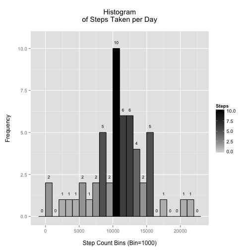

The purpose of this document is to develop and answer the Coursera Peer Assessment 1 for Coursera Reproducible Research.

### Step 1: Setup environment and load data set...

The first step is to load the required R packages, download and extract the target zip file into the data subdirectory, that we create if it does not exist. We then load the data into a data frame in preperation for manupulation. **Note:** This program assumes that all the data will be downloaded into the 'data' directory below the working directory.

#### Data

The data for this assignment is downloaded from the course [web site][1]:

- **Dataset**: [Activity monitoring data [52K]][2]

The variables included in this dataset are:

- **steps**: Number of steps taking in a 5-minute interval (missing values are coded as NA)
- **date**: The date on which the measurement was taken in YYYY-MM-DD format
- **interval**: Identifier for the 5-minute interval in which measurement was taken

The dataset is stored in a comma-separated-value (CSV) file and there are a total of 17,568 observations in this dataset.

[1]: https://class.coursera.org/repdata-012 "Reproducible Research"
[2]: https://d396qusza40orc.cloudfront.net/repdata%2Fdata%2Factivity.zip "Activity monitoring data"


```r
setwd("~/dev/cousera/datascience/05_ReproducibleResearch/assessment1")

requiredPackages <- c("ggplot2", "scales")

ipak <- function(pkg){
        new.pkg <- pkg[!(pkg %in% installed.packages()[, "Package"])]
        if (length(new.pkg))
                install.packages(new.pkg, dependencies = TRUE)
        sapply(pkg, require, character.only = TRUE)
}

ipak(requiredPackages)
```

```
## ggplot2  scales 
##    TRUE    TRUE
```

```r
dataDir         <- "./data"
fileUrl         <- "https://d396qusza40orc.cloudfront.net/repdata%2Fdata%2Factivity.zip"
fileName        <- "activity.csv"               # Extracted File Name
filePath        <- file.path(dataDir, fileName) # Filepath to extracted file

# If the data dir does not exist we create it, so it can be used to store the
# downloaded data

if (!file.exists(dataDir)) {
        dir.create(dataDir)
}

# Now we download the zip file... and extract it...

if (!file.exists(filePath)) {
        temp <- tempfile()
        download.file(fileUrl, temp, mode="wb", method = "curl")
        unzip(temp, exdir = dataDir)
        unlink(temp)
}

# Load the dataset in preperation for manipulation...

activityData <- read.csv(filePath, colClasses = c("integer", "Date", "factor"))
str(activityData)
```

```
## 'data.frame':	17568 obs. of  3 variables:
##  $ steps   : int  NA NA NA NA NA NA NA NA NA NA ...
##  $ date    : Date, format: "2012-10-01" "2012-10-01" ...
##  $ interval: Factor w/ 288 levels "0","10","100",..: 1 226 2 73 136 195 198 209 212 223 ...
```
## Step 2: Answers the questions posed...

### Question 1: What is the mean total number of steps taken per day?

** Note** For this part of the assignment, we are instructed we can ignore the missing values in the dataset.

1. Calculate the **total number of steps** taken **per day**

#### Answer:

To calculate the **total number of steps** taken **per day** we take the activityData and sum the steps by day to create the **stepsPerDay** dataframe that contains the number of steps by day...


```r
stepsPerDay <- aggregate(steps ~ date, data = activityData, FUN = sum)
stepsPerDay
```

```
##          date steps
## 1  2012-10-02   126
## 2  2012-10-03 11352
## 3  2012-10-04 12116
## 4  2012-10-05 13294
## 5  2012-10-06 15420
## 6  2012-10-07 11015
## 7  2012-10-09 12811
## 8  2012-10-10  9900
## 9  2012-10-11 10304
## 10 2012-10-12 17382
## 11 2012-10-13 12426
## 12 2012-10-14 15098
## 13 2012-10-15 10139
## 14 2012-10-16 15084
## 15 2012-10-17 13452
## 16 2012-10-18 10056
## 17 2012-10-19 11829
## 18 2012-10-20 10395
## 19 2012-10-21  8821
## 20 2012-10-22 13460
## 21 2012-10-23  8918
## 22 2012-10-24  8355
## 23 2012-10-25  2492
## 24 2012-10-26  6778
## 25 2012-10-27 10119
## 26 2012-10-28 11458
## 27 2012-10-29  5018
## 28 2012-10-30  9819
## 29 2012-10-31 15414
## 30 2012-11-02 10600
## 31 2012-11-03 10571
## 32 2012-11-05 10439
## 33 2012-11-06  8334
## 34 2012-11-07 12883
## 35 2012-11-08  3219
## 36 2012-11-11 12608
## 37 2012-11-12 10765
## 38 2012-11-13  7336
## 39 2012-11-15    41
## 40 2012-11-16  5441
## 41 2012-11-17 14339
## 42 2012-11-18 15110
## 43 2012-11-19  8841
## 44 2012-11-20  4472
## 45 2012-11-21 12787
## 46 2012-11-22 20427
## 47 2012-11-23 21194
## 48 2012-11-24 14478
## 49 2012-11-25 11834
## 50 2012-11-26 11162
## 51 2012-11-27 13646
## 52 2012-11-28 10183
## 53 2012-11-29  7047
```

2. **Make a histogram of the total number of steps taken each day.** 

If you do not understand the difference between a histogram and a barplot, research the difference between them. 

#### Answer:

A histogram is "a representation of a frequency distribution by means of rectangles whose widths represent class intervals and whose areas are proportional to the corresponding frequencies. Essentially, we graph groups of numbers according to how often they appear. Thus if we have the set {1,2,2,3,3,3,3,4,4,5,6}, we would show a bar for two 2's, four 3's etc. The shape of the graph gives us an idea of how the numbers in the set are distributed about the mean; the distribution of this graph is wide compared to size of the peak, indicating that values in the set are only loosely bunched around the mean. With a *histogram*, we can **bin** the data into convenient ranges to catagorise the data into ranges or buckets.

In this context, we want to create a histogram that shows **steps taken per day**, to do this we took the activity data (**ActivityData**) and aggregate the steps by day (**stepsperDay**) and plot this data using *ggplot2* **geom_historgram()** and divide the data into bin sizes of 1000 steps resulting in the histogram shown below.  


```r
gp <- ggplot(stepsPerDay, aes(x=steps)) 
gp <- gp + geom_histogram(aes(fill = ..count..), binwidth=1000, color="black", width=.2)
gp <- gp + scale_fill_gradient("Steps", low = "lightgrey", high = "black")
# One thing we want to do is show the bin count above each bar of the histogram.
# We do this by using the stat_bin() function, where we set the label to the
# count of the bin as defiend by the binwidth...
gp <- gp + stat_bin(binwidth = 1000,
                    aes( y = (..count..),
                         label = (..count..), 
                         ymax = max(..count..) * 1.05 ), 
                    geom  = "text", 
                    size  = 3,
                    vjust = -1.5)
gp <- gp + xlab(paste0("\n","Step Count Bins (Bin=1000)"))
gp <- gp + ylab(paste0("Frequency","\n"))
# Here we create a plot title across two lines...
title <- paste("Histogram")
title2 <- paste("of Steps Taken per Day")
gp <- gp + ggtitle(paste0(title,"\n", title2, "\n"))
# Now display the plot...
print(gp)
```

 

3. Calculate and report the **mean** and **median** of the **total number of steps** taken **per day**

#### Answer:

To calculate the **mean** and **medium** we take the dataframe we created earlier and calculate the **mean** and **medium** across of the **steps** column in the **stepsPerDay** dataframe. We can now compare that with the **histogram** we created earlier. 

*Note that the histogram maps to the mean and medium results below...*

#### Result: 

Mean =  **10766.19**
Medium = **10765**


```r
mean(stepsPerDay$steps)
```

```
## [1] 10766.19
```

```r
median(stepsPerDay$steps)
```

```
## [1] 10765
```

### Question 2: What is the average daily activity pattern?

1. Make a time series plot (i.e. type = "l") of the 5-minute interval (x-axis) and the average number of steps taken, averaged across all days (y-axis)


1. Which 5-minute interval, on average across all the days in the dataset, contains the maximum number of steps?


#### Imputing missing values

Note that there are a number of days/intervals where there are missing values (coded as NA). The presence of missing days may introduce bias into some calculations or summaries of the data.

1. Calculate and report the total number of missing values in the dataset (i.e. the total number of rows with NAs)


2. Devise a strategy for filling in all of the missing values in the dataset. The strategy does not need to be sophisticated. For example, you could use the mean/median for that day, or the mean for that 5-minute interval, etc.


3. Create a new dataset that is equal to the original dataset but with the missing data filled in.


4. Make a histogram of the total number of steps taken each day and Calculate and report the mean and median total number of steps taken per day. Do these values differ from the estimates from the first part of the assignment? What is the impact of imputing missing data on the estimates of the total daily number of steps?


